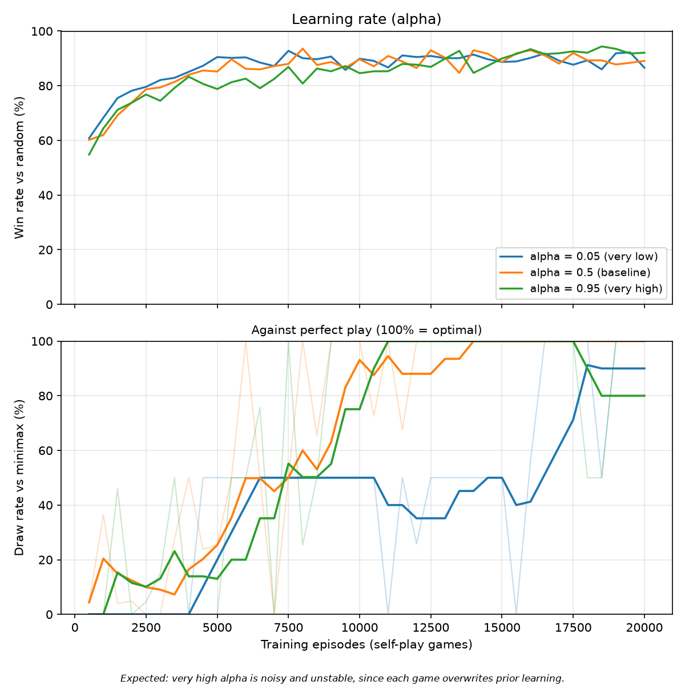
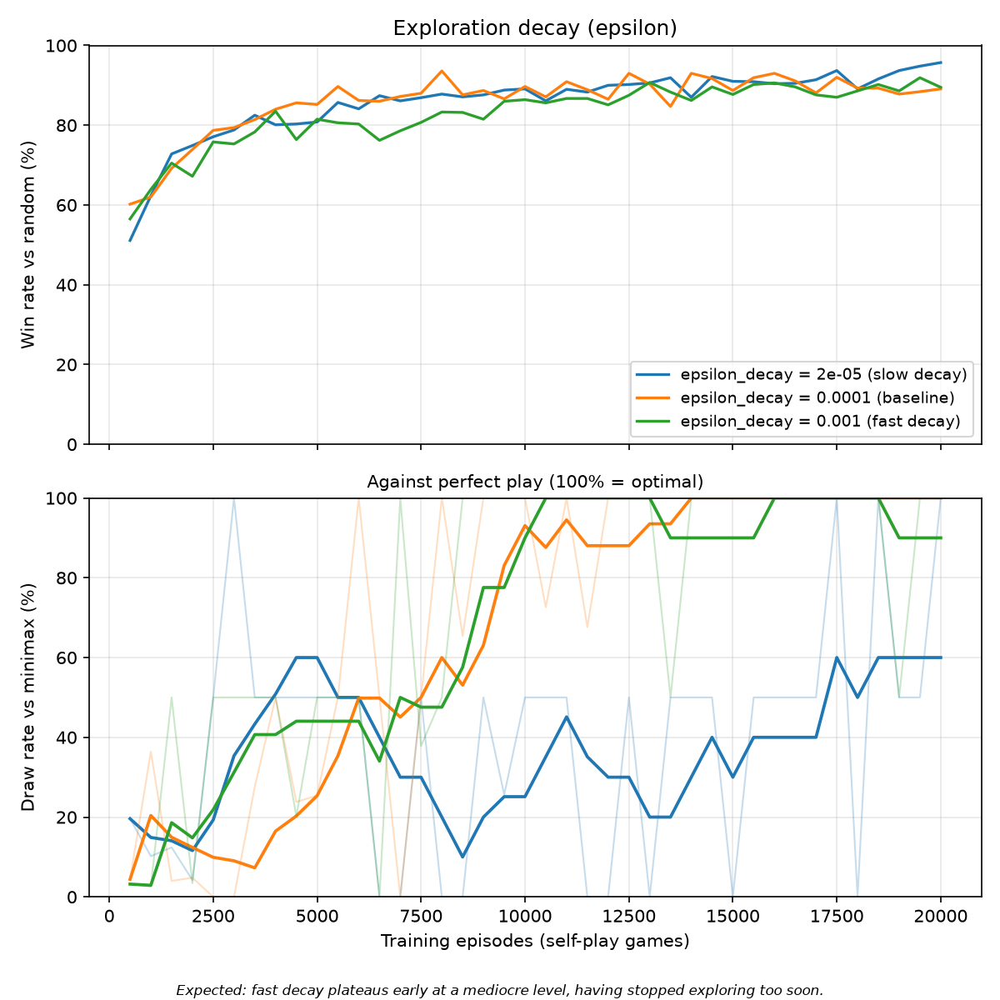
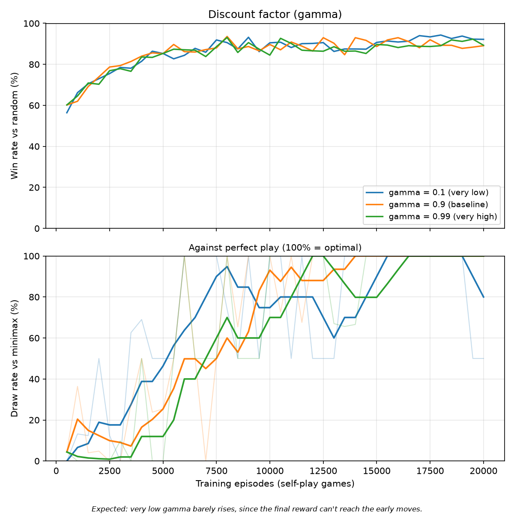

# Evaluation Results

Generated by `evaluation/run_evaluation.py` and `evaluation/hyperparameter_study.py`, plotted by `evaluation/plots.py`.

## Matchups (1000 games each, seed 20250816)

Who goes first alternates every game, so the first-move advantage is split evenly and doesn't skew the numbers.

| Matchup | A wins | B wins | Draws | A win rate | Draw rate |
|---|---:|---:|---:|---:|---:|
| Q-agent vs random | 920 | 4 | 76 | 92.0% | 7.6% |
| Q-agent vs minimax | 0 | 0 | 1000 | 0.0% | 100.0% |
| minimax vs random | 897 | 0 | 103 | 89.7% | 10.3% |
| random vs random | 410 | 472 | 118 | 41.0% | 11.8% |

**Headline numbers**

- Win rate vs random: **92.0%** — the agent learned to punish mistakes.
- Draw rate vs minimax: **100.0%** (target 100%) — the agent reached optimal play.
- Losses to minimax: 0, wins against minimax: 0 (any win here would be a bug in minimax, not an achievement).

## Hyper-parameter study (20000 episodes per run, seed 20250816)

One knob varied at a time, the others held at the baseline (alpha 0.5, gamma 0.9, epsilon decay 0.0001, min epsilon 0.05). Final scoring is over 1000 games per matchup.

| Knob | Value | | vs random W/L/D | Win rate | vs minimax W/L/D | Draw rate |
|---|---:|---|---|---:|---|---:|
| alpha | 0.05 | very low | 876/48/76 | 87.6% | 0/0/1000 | 100.0% |
| alpha | 0.5 | baseline | 896/15/89 | 89.6% | 0/0/1000 | 100.0% |
| alpha | 0.95 | very high | 948/9/43 | 94.8% | 0/0/1000 | 100.0% |
| gamma | 0.1 | very low | 910/10/80 | 91.0% | 0/500/500 | 50.0% |
| gamma | 0.9 | baseline | 896/15/89 | 89.6% | 0/0/1000 | 100.0% |
| gamma | 0.99 | very high | 886/7/107 | 88.6% | 0/0/1000 | 100.0% |
| epsilon_decay | 0.001 | fast decay | 857/42/101 | 85.7% | 0/0/1000 | 100.0% |
| epsilon_decay | 0.0001 | baseline | 896/15/89 | 89.6% | 0/0/1000 | 100.0% |
| epsilon_decay | 2e-05 | slow decay | 936/15/49 | 93.6% | 0/0/1000 | 100.0% |

## What the numbers actually show

**The win rate against random barely separates the settings.** Across all 9 runs it lands between 85.7% and 94.8%, a spread of only 9.1 points, and the learning curves below sit on top of each other. Beating a random opponent turns out to be an easy bar that even a badly-tuned agent clears, so this metric saturates and stops being informative. That is itself a result: it is exactly why the spec asks for the minimax matchup as well.

**The minimax draw rate is what actually discriminates.** These settings failed to reach optimal play:

- `gamma = 0.1` (very low): drew only 50.0% against minimax, losing 500 of 1000 games — while still winning 91.0% against random.

The gamma result is the clean confirmation of the theory. With the discount factor that low, the reward at the end of the game is worth almost nothing by the time it propagates back to the opening moves, so the agent never learns which early moves set up the win. It still punishes a random opponent's blunders, but against perfect play it has nothing to fall back on.

**The alpha and epsilon predictions did not reproduce in the final numbers.** High alpha was expected to look noisy and unstable and fast epsilon decay was expected to plateau early; both still finished on a 100% draw rate against minimax. Tic-tac-toe is small enough (5,478 reachable states) that the agent visits the whole space many times over, which papers over settings that would be fatal on a larger problem. Reporting this rather than the prediction is the honest version.

**Finishing at 100% is not the same as having converged.** Over the last quarter of the training probes, these settings were still dropping in and out of optimal play rather than holding it:

- `alpha = 0.05` (very low): optimal on only 70% of the final 10 probes, despite a 100% draw rate in the end-of-training scoring.
- `epsilon_decay = 2e-05` (slow decay): optimal on only 30% of the final 10 probes, despite a 100% draw rate in the end-of-training scoring.

Slow epsilon decay is the clearest case. It is still roughly 60% exploratory when training stops, so the Q-table is being churned right to the end and the greedy policy it implies is only intermittently optimal. It scores 100% in the table because the final measurement happens to land on a good moment. This is the strongest argument in the study for reporting learning curves and not just final numbers.

**A caveat on reading the lower panel.** Minimax plays deterministically, and a greedy Q-agent is deterministic too apart from how it breaks ties between equally valued moves. So a probe of N games isn't N independent samples — it is largely the same two games (once as X, once as O) played over and over. Measured directly, the fully trained agent produces only three distinct game lines in 200 games against minimax, and 84% of the points on that panel land exactly on 0%, 50% or 100%. Read 50% as "draws with one mark, loses with the other", not as a probability. The faint line is the raw measurement and the bold line is a 5-point trailing average, since the raw signal flips between those levels as tie-breaks shift mid-training.

## Learning curves

### Learning rate (alpha)



Expected: very high alpha is noisy and unstable, since each game overwrites prior learning.

### Exploration decay (epsilon)



Expected: fast decay plateaus early at a mediocre level, having stopped exploring too soon.

### Discount factor (gamma)



Expected: very low gamma barely rises, since the final reward can't reach the early moves.

## Reproducibility

Every experiment sets a fixed seed, recorded in the tables above. Python's `random` is a deterministic sequence starting from that seed, so rerunning with the same seed reproduces these numbers exactly:

```
python -m evaluation.run_evaluation
python -m evaluation.hyperparameter_study
python -m evaluation.plots
```
